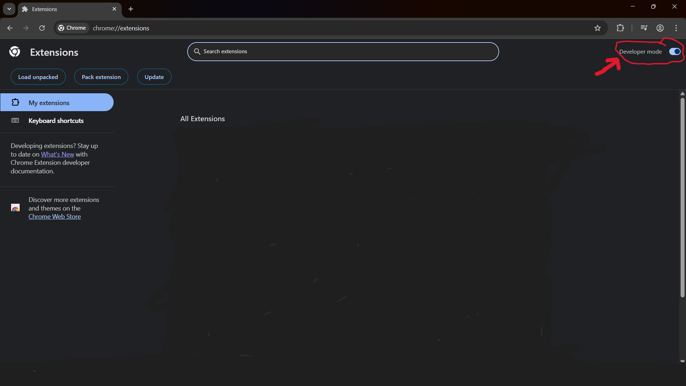
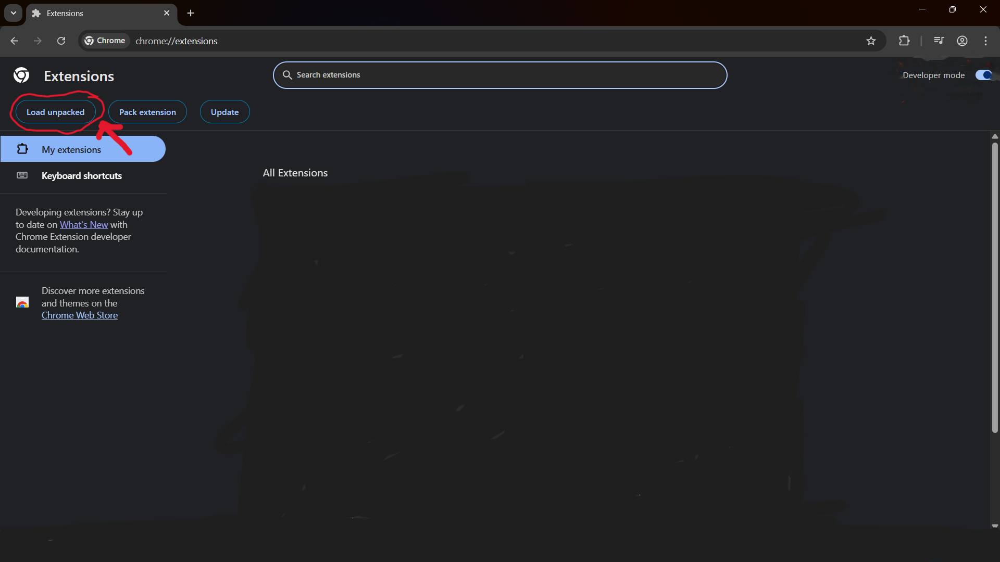
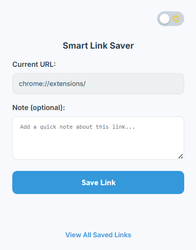
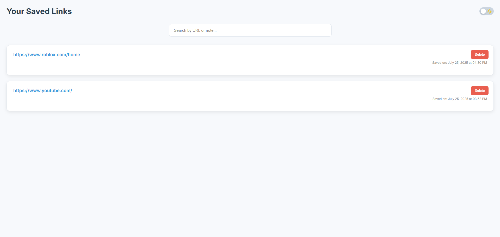

# Smart Link Saver Chrome Extension

## Effortlessly Save and Organize Your Web Links

 

Smart Link Saver is a powerful and intuitive Chrome extension designed to help you quickly save web pages with custom notes, keeping your valuable online resources perfectly organized and easily searchable. No more lost links or forgotten contexts!

## ✨ Features

* **Quick Save:** Save any web page instantly with a single click from your browser toolbar.
* **Add Notes:** Attach custom, descriptive notes to your saved links, helping you remember why you saved them and what's important about them.
* **Search & Filter:** Easily find your saved links by searching through both URLs and your custom notes.
* **Organized View:** Access all your links in a clean, dedicated page within the extension, sorted by most recently saved.
* **Dark Mode Support:** Enjoy a comfortable Browse experience with built-in dark mode for the extension's user interface.
* **Local Storage:** Your data is stored securely in your browser's local storage, ensuring your privacy and offline access to your saved links.

## 🚀 How It Works

Using Smart Link Saver is straightforward:

1.  **Click the Icon:** When you're on a web page you want to save, simply click the Smart Link Saver icon in your Chrome browser toolbar.
2.  **Add a Note (Optional):** A small popup will appear, showing the current page's URL. You can add a quick note to provide context or reminders.
3.  **Save Link:** Click the "Save Link" button.
4.  **View Your Collection:** From the popup, click "View All Saved Links" to open a full page where you can browse, search, and manage all your saved items.

## 📥 Installation

Currently, Smart Link Saver is available as an unpacked Chrome extension. Follow these steps to install it:

1.  **Download the Extension:**
    * Download the latest `.zip` file from the [releases page](https://github.com/Alapipapi/smart-link-saver-extension/releases).
2.  **Extract the Folder:**
    * Unzip the downloaded file. This will create a folder (e.g., `smart-link-saver-extension-main` or similar). Remember the location of this folder.
3.  **Open Chrome Extensions Page:**
    * In your Chrome browser, type `chrome://extensions` into the address bar and press `Enter`.
4.  **Enable Developer Mode:**
    * In the top-right corner of the Extensions page, toggle on the "Developer mode" switch.
    
5.  **Load Unpacked:**
    * Click the "Load unpacked" button that appears.
    * Navigate to and select the unzipped `smart-link-saver-extension` folder (the one containing `manifest.json`).
    
6.  **You're Done!**
    * The Smart Link Saver extension should now appear in your list of extensions and be ready to use! You might want to "pin" it to your toolbar for easy access.

## 📸 Screenshots

*(You'll need to create and add these screenshots to your `images` folder within this repository)*

| Popup View                                        | Saved Links View                                    |
| :----------------------------------------------   | :-------------------------------------------------- |
|  |               |
## 🤝 Contributing

We welcome contributions to the Smart Link Saver Extension! If you have suggestions, bug reports, or want to contribute code, please follow these guidelines:

1.  **Fork the repository.**
2.  **Create your feature branch:** `git checkout -b feature/AmazingFeature`
3.  **Commit your changes:** `git commit -m 'Add some AmazingFeature'`
4.  **Push to the branch:** `git push origin feature/AmazingFeature`
5.  **Open a Pull Request.**

### Found a Bug or Have a Feature Request?

Please open an issue on our [GitHub Issues page](https://github.com/Alapipapi/smart-link-saver-extension/issues).

## 📄 License

This project is licensed under the MIT License - see the [LICENSE](LICENSE) file for details.

## 📧 Contact

If you have any questions or general feedback about the Smart Link Saver Extension, feel free to reach out by opening an issue on GitHub.

---
